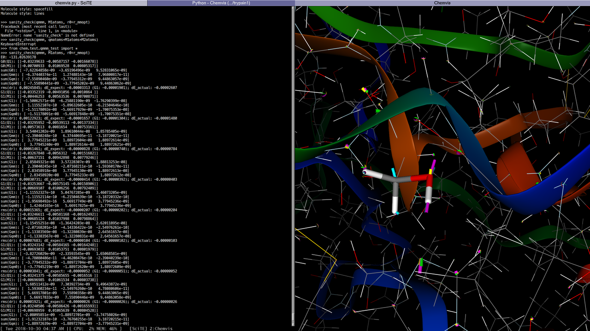

chem: collection of mostly python code for molecular visualization, QM/MM, FEP, etc.  Very long-term goal is something like enzyme design.  Intended for interactive use from standard python prompt.

Major features:
- 3D visualization of molecular geometry, orbitals, ESP, etc.
  - fast OpenGL volume and isosurface rendering
  - oriented toward analysis and debugging of calculations rather than presentation (for that, try [molstar](https://github.com/molstar/molstar))
- QM/MM driver supporting electrostatic embedding with various charge shifting schemes
- DLC/HDLC/Redundant internal coordinates
- transition state search (Dimer method, Lanczos method), reaction path optimization (NEB)
- read/write .pdb, .xyz (TINKER/generic), GAMESS and NWChem files
- model creation and setup: build polypeptides, add hydrogens and bonds, mutate residues, solvate
- free energy methods: FEP, BAR, umbrella sampling

How to use this code:
1. If an example in projects/ or test/ looks promising, try using that as a starting point ... currently, most of the examples are outdated or work-in-progress.  Open an issue describing what you're interested in doing and I'll help with getting started.
- add `import pdb; pdb.set_trace()` to step line by line
- see "Examples" in test/vis_test.py for standalone visualization examples
or
2. Cut and paste what you need: code is kept as self-contained as possible
 - opt/dlc.py: delocalized internal coordinates (DLC) and hybrid DLC; useful for geometry opt. w/ constraints
 - opt/lbfgs.py: gradient-only BFGS and L-BFGS optimizers (i.e., no line search)
 - opt/neb.py: nudged elastic band (reaction path optimization)
 - opt/dimer.py: Dimer and Lanczos methods (transition state search)
 - qmmm/resp.py: RESP/CHELPG charge fitting (only harmonic restraints currently)
 - mm.py: slow but simple MM energy and gradient for AMBER-type force field (and Hessian for Coulomb and LJ), GBSA implicit solvation energy
 - molecule.py: atom selection, molecule alignment
 - fep.py: simple FEP, BAR free energy calculations; MM-GBSA binding energy
 - analyze.py: solvent accessible surface area, hydrogen bonding (DSSP), secondary structure
 - model/build.py: build polypeptides, add hydrogens and bonds, mutate residues, set rotamers
 - model/prepare.py: build solvent box, solvate, neutralize, check geometry

Requirements:
- Python 3 w/ scipy and numpy (should mostly still work with Python 2.7)
- [OpenMM](https://openmm.org/) - molecular mechanics calculations
- [PySCF](https://github.com/sunqm/pyscf) - quantum chemistry calculations

See misc/chem-inst.sh for setup on Debian/Ubuntu

Optionally:
- [openmmtools](https://github.com/choderalab/openmmtools) - free energy calculations
- [AmberTools](https://ambermd.org/AmberTools.php) - small molecule parameterization (GAFF)
- [TINKER](https://dasher.wustl.edu/tinker/) - molecular mechanics calculations
- GAMESS (US) or NWChem - quantum chemistry calculations
- https://github.com/cclib/cclib - for reading GAMESS and NWChem output

Credit to [chemlab](https://github.com/chemlab/chemlab/) (3D camera, some shaders) and [speck](https://github.com/wwwtyro/speck) (some shaders), among others.

Screenshot: 1MCT.pdb shown with backbone ribbon, MM atoms as lines, QM atoms as sticks, and components of QM/MM force on each atom as yellow, cyan, magenta cylinders.

